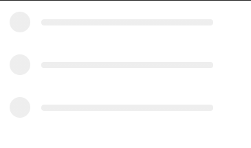

## content-loader

***Content Loader to easily create placeholder loading, image loading, card loading, etc .., free to change the colors, speed, sizes, radius and shadow also have few deafult Loding Componets to use.***

#


[](https://www.npmjs.com/package/content-loader) [](https://standardjs.com)

# Features

- ⚙ **Customizable:** Feel free to change the colors, speed, sizes, radius and shadow;
- ▶**Plug and play:** with many deafault component to use see the example below.
- 📝**DIY:** create your own custom loaders easily;


## Install

```bash
npm install --save content-loader
```

# Usage

```jsx
import { ContentLoader } from 'content-loader'
const CustomLoader = () => {
  return (
   <ContentLoader />
  )
}
```

# Options

| <div style="width:250px">Prop name and type</div>             | Values                | Description                                                                                                                                                                                                                                                                                         |
| ------------------------------------------------------------- | -------------------------- | --------------------------------------------------------------------------------------------------------------------------------------------------------------------------------------------------------------------------------------------------------------------------------------------------- |
| **`rows?: number`** <br/> Defaults to `0`             | - |  It's use to create multiple loader at once in a page |
| **`background?: string`** <br/> Defaults to `#eeeeee` | - | It's is use to change the background of your ContetnLoader|
|  **`forground?: string`** <br/> Defaults to `#dddddd` | - | It's is use to change the forground color of your ContetnLoader|
| **`elevation?: number`** <br /> Defaults to `0.08`    | - | It's is use for background outset shadow to your ContentLoader|
| **`speed?: string`** <br /> Defaults to `fast`     | (`slow - fast - xfast`) | Controll Speed of animation|
| **`rounded?: string`** <br /> Defaults to `0px`       | - | Curve of your Loader Component in px , percentage (%)...<br/>available for use in `<ContentLoader/> , <ProfileStyle />`|
| **`style?: object`**        | - | Give extra styling you want accept all css properties <br/>available for use in `<ContentLoader/>` |
| **`size?: {height? : number, Width? : number}`**  | - | It's use to change the height and width your ContentLoader </br> only props use while creating custom ContentLoader `<ContentLoader />`  |
| **`radius?: string`** <br /> Defaults to `sm`   | (`xs - sm - md - lg - xl`)  | Used as background of animation. |
| **`variant?: string`** <br /> Defaults to `rounded`| (`default - rounded`)| Shape for the define Style like <br/>`<SocialStyle />, <CodeStyle />,<BulletStyle />`|


## Example 
`**Plug and play component**`
#
## 1. **Social Style**
#
```jsx
import { SocialStyle } from 'content-loader'
const YourStyleName = () => {
  return (
    <SocialStyle  />
  )
}
```


## 2. **Bullet List Style**
#
```jsx
import { BulletListStyle } from 'content-loader'
const YourStyleName = () => {
  return (
    <BulletListStyle  />
  )
}
```


## 3. **Code Style**
#
```jsx
import { CodeStyle } from 'content-loader'
const YourStyleName = () => {
  return (
    <CodeStyle  />
  )
}
```


## 4. **Profile Style**
#
```jsx
import { ProfileStyle } from 'content-loader'
const YourStyleName = () => {
  return (
    <ProfileStyle  />
  )
}
```


## 5. **Custom Creation**
`Custom ContentLoader Creation with Css Tricks works Awsome 😎 Live Working Example at the Top`
#
```jsx
import { ContentLoader } from 'content-loader'
const YourStyleName = () => {
  return (
    <div style={{ padding: "1rem", display: "flex", alignItems: "center", justifyContent: "center" }} >
      <div>
        <div style={{ display: "flex", alignItems: "center" }}>
          <ContentLoader size={{ height: 80, width: 80 }} rounded="10%" />
          <div style={{ paddingLeft: "2rem" }}>
            <ContentLoader style={{ marginBottom: "1rem" }} size={{ height: 15, width: 200 }} />
            <ContentLoader size={{ height: 15, width: 100 }} />
          </div>
        </div>
        <ContentLoader style={{ marginTop: "1rem" }} rounded={"10px"} size={{ height: 15, width: 350 }} />
        <ContentLoader style={{ marginTop: "1rem" }} rounded={"10px"} size={{ height: 15, width: 350 }} />
      </div>
    </div>
  )
}
```


## License

MIT © [Tirth886](https://github.com/Tirth886)
